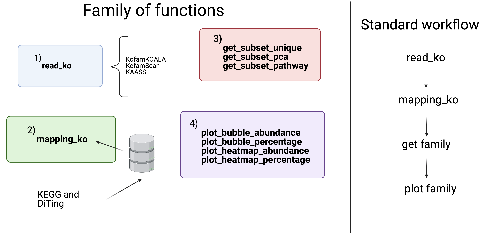

<!-- README.md is generated from README.Rmd. Please edit that file -->

```{r, include = FALSE}
knitr::opts_chunk$set(
  collapse = TRUE,
  comment = "#>",
  fig.path = "man/figures/README-",
  out.width = "100%"
)
```

  <!-- badges: start -->
  [](https://github.com/mirnavazquez/RbiMs/actions)
  <!-- badges: end -->

# **Rbims**  

<!-- badges: start -->
<!-- badges: end -->

R tools for reconstructing bin metabolisms.

## Quick install

We are actively developing rbims, for now it is not available at CRAN or Bioconductor, however you can access the development version from [GitHub](https://github.com/mirnavazquez/RbiMs).

In R terminal:

``` r
install.packages("devtools")
```

If you are in a MAC system, you will need to download [XQuartz](https://www.xquartz.org/), you can read more about it [here](https://stackoverflow.com/questions/38952427/include-cairo-r-on-a-mac). As well if you are in ubuntu you need to install libcairo2-dev, you can read more about it [here](https://stackoverflow.com/questions/51940792/r-cairo-package-installation-failed-in-ubuntu-18-04).

``` r
library(devtools)
install_github("mirnavazquez/RbiMs")
library(rbims)
```

## Overview



## Visit the [website](https://mirnavazquez.github.io/RbiMs/) for more detail. 

## New function to write a metabolism workbook

If you want to create a metabolism table in excel that includes KEGG and interproscan outputs you can use this new function.

```
library(rbims)
write_metabolism("Interpro_test.tsv", 
                 "path/to/KEGG/output/")
```


## Contributions

- Mirna Vázquez Rosas Landa - wrote the code. 
- Kathryn Appler, Valerie De Anda and Pedro Leão  - Curated the rbims database of metabolism. 
- Sahil Shah - Helped with function documentation.
- Bryan Vernon - Editor and shiny app developer.


##  References

* Kanehisa, M. and Goto, S.; KEGG: Kyoto Encyclopedia of Genes and Genomes. Nucleic Acids Res. 28, 27-30 (2000).
* Kanehisa, M; Toward understanding the origin and evolution of cellular organisms. Protein Sci. 28, 1947-1951 (2019).
* Kanehisa, M., Furumichi, M., Sato, Y., Ishiguro-Watanabe, M., and Tanabe, M.; KEGG: integrating viruses and cellular organisms. Nucleic Acids Res. 49, D545-D551 (2021).
* [DiTing](https://github.com/xuechunxu/DiTing) cycles definition.


