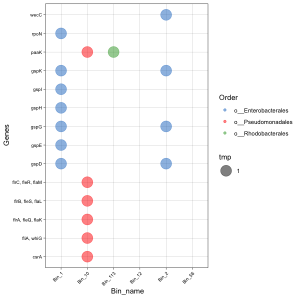
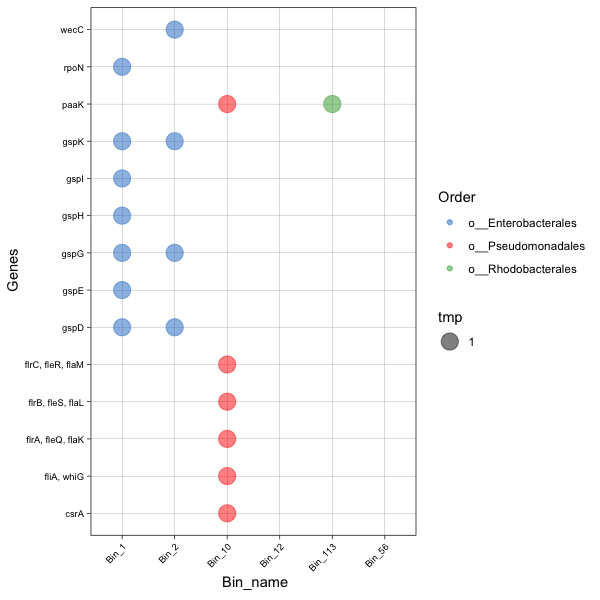
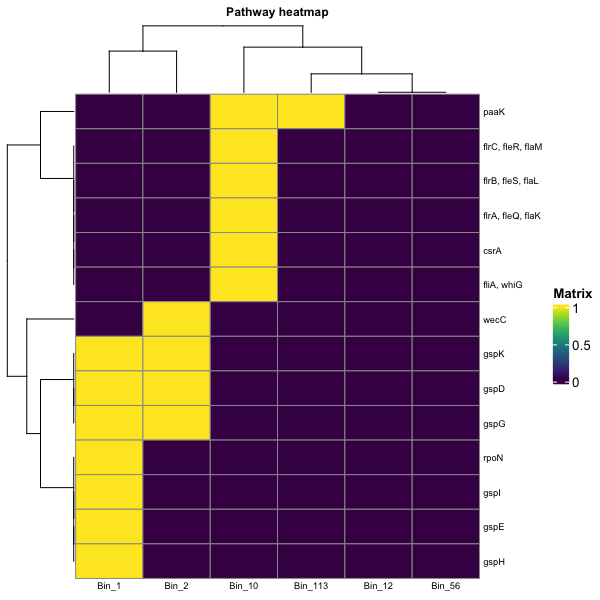

<!-- README.md is generated from README.Rmd. Please edit that file -->

```{r, include = FALSE}
knitr::opts_chunk$set(
  collapse = TRUE,
  comment = "#>",
  fig.path = "man/figures/README-",
  out.width = "100%"
)
```

  <!-- badges: start -->
  [](https://github.com/mirnavazquez/RbiMs/actions)
  <!-- badges: end -->

# **Rbims**  

<!-- badges: start -->
<!-- badges: end -->

R tools for reconstructing bin metabolisms.

##  Quick install

In R terminal:

``` r
if (!requireNamespace("BiocManager", quietly = TRUE)) install.packages("BiocManager")
BiocManager::install(c("KEGGREST", "devtools"))
```

And the development version from [GitHub](https://github.com/mirnavazquez/RbiMs) with:

``` r
library(devtools)
install_github("mirnavazquez/RbiMs")
library(rbims)
```

## Overview 


## Quick Example

The first thing to do would be read the kofamScan output and the metadata file. The metadata file is a tab-separated file containing the name of your bins and any extra information you would like to use for visualization.

```r 
ko_bin_table<-read_ko(data_kofam = "all.kofam.txt")
metadata <-read.table("metadata.txt", sep = "\t")
```

Then map the KO to the rest of the features of the KEGG database and rbims database.

```r 
ko_bin_mapp<-mapping_ko(ko_bin_table)
```

Let's say that you are interested in the genes associated with the biofilm formation in Vibrio Cholerae.

- One first thing could be to create a vector containing the name of the KEGG pathway associated with the biofilm formation in Vibrio Cholerae.

```r 
Biofilm_Vibrio<-c("map05111")
```

- Now, let's extract the profile associated with that metabolic pathway.

```r 
Biofilm_Vibrio_subset<-ko_bin_mapp%>%
  drop_na(Pathway) %>%
  get_subset_pathway(Pathway, Biofilm_Vibrio) 
```
- Now, let's create a plot of presence and absence of the different KO associated to that pathway. Besides presence and absence, it is possible to plot abundance or the percentage of genes within certain pathways (See ?plot_bubble, calc argument). 

```r 
plot_bubble(tibble_ko = Biofilm_Vibrio_subset,
            x_axis = Bin_name, 
            y_axis = KO,
            analysis="KEGG",
            data_experiment = metadata,
            calc="Binary",
            color_character = Phylum,
            range_size = c(1,10)) 
```

 


###  Order axis

Let's say that you want to order by bin names.

- Create a vector containing the order.

```r 
order_taxa<-c("Bin_1", "Bin_2", "Bin_10", "Bin_113")
```

- Now plot, using the order_bins argument.

```r 
plot_bubble(tibble_ko = Biofilm_Vibrio_subset,
            data_experiment = metadata,
            x_axis = Bin_name,
            y_axis = Genes,
            analysis="KEGG",
            calc="Binary",
            order_bins=order_taxa,
            color_character=Genus,
            range_size = c(5,6))
```

 

```r 
plot_heatmap(tibble_ko=Biofilm_Vibrio_subset, 
             y_axis=Genes, 
             calc="Binary")
```

 

##  References

* Kanehisa, M. and Goto, S.; KEGG: Kyoto Encyclopedia of Genes and Genomes. Nucleic Acids Res. 28, 27-30 (2000).
* Kanehisa, M; Toward understanding the origin and evolution of cellular organisms. Protein Sci. 28, 1947-1951 (2019).
* Kanehisa, M., Furumichi, M., Sato, Y., Ishiguro-Watanabe, M., and Tanabe, M.; KEGG: integrating viruses and cellular organisms. Nucleic Acids Res. 49, D545-D551 (2021).
* [DiTing](https://github.com/xuechunxu/DiTing) cycles definition.


