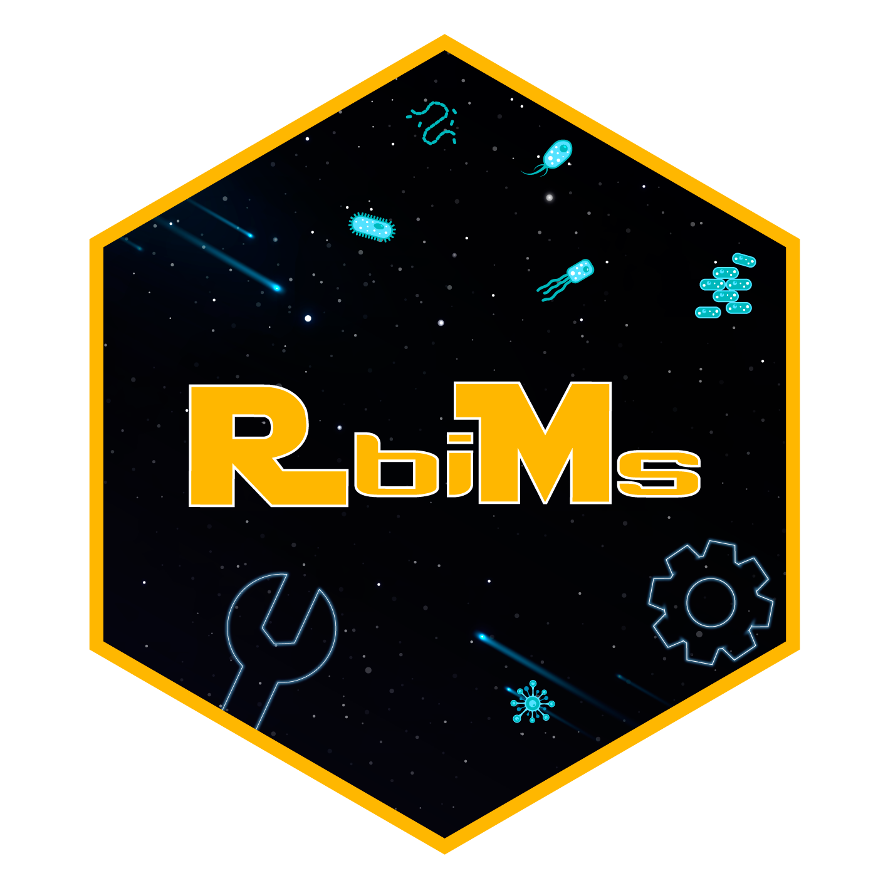
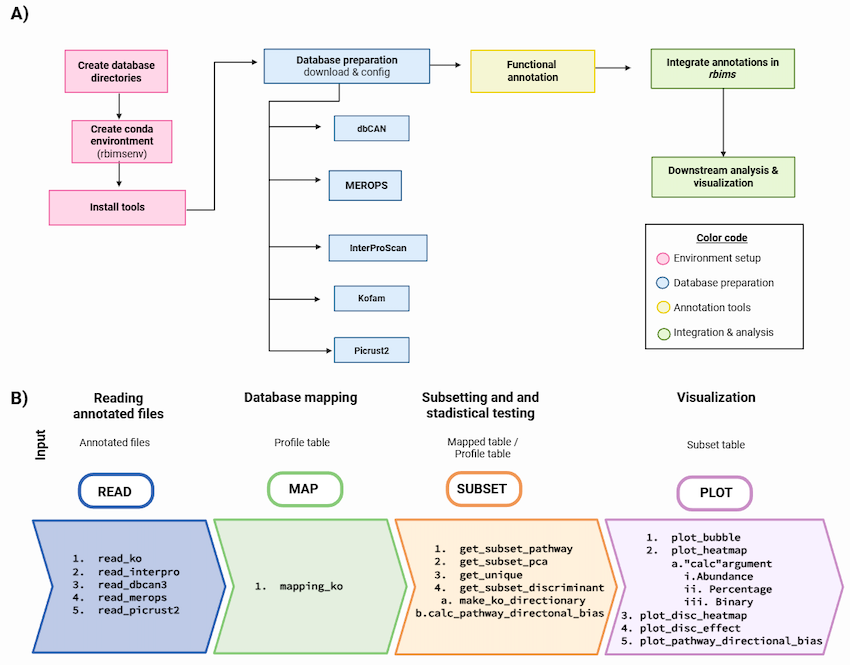

<!-- README.md is generated from README.Rmd. Please edit that file -->
# rbims 

[](https://github.com/mirnavazquez/RbiMs/actions)

**rbims** (Reconstruction of Bin Metabolisms) is an R package designed to streamline the functional analysis and visualization of metagenome-assembled genomes (MAGs). It supports annotation integration from KEGG, InterProScan, dbCAN, MEROPS, and Picrust2 allowing researchers to quantify gene presence, abundance, and pathway coverage across microbial genomes.

- **rbims** also integrates ALDEx2-derived effect sizes and random forest importance scores into a consensus table that prioritizes candidate discriminant KOs.This allows to distinguish enriched KO's between groups.  
- Moreover, **rbims** enables a **pathway-level directional bias analysis** based on the discriminant output. This hierarchical framework allows rbims to distinguish between isolated gene-level differences and structurally coherent pathway-level enrichment across experimental gradients.

- The package includes a curated database for hydrocarbon degradation pathways (aerobic and anaerobic) and provides tools to generate publication-ready visualizations such as heatmaps and bubble plots. It is designed to assist in exploratory trait analysis and early-stage hypothesis generation in genome-resolved metagenomics.

---

## ✨ Features

- Conda environment creation tutorial (**rbimsenv**) to run consistent annotations. 
- Import functional annotations from KEGG, InterProScan, dbCAN, MEROPS, and PICRUSt2.
- Calculate presence, abundance, and pathway coverage per MAG.
- Subset data by gene, enzyme, pathway, or domain.
- Performs a discriminant analysis and pathway directional bias to distinguish enrichment of traits in environmental gradients. 
- Visualize functional traits with customizable bubble plots and heatmaps.
- Integrate sample or genome metadata.
- Export data frames and visualizations for publication.
- Curated database for hydrocarbon degradation not covered in KEGG.
- Performs a discriminant analysis and pathway directional bias test to distinguish between isolated gene-level differences and structurally coherent pathway-level enrichment across experimental gradients.


<div align="center">
  
  <p style="font-size: 14px; max-width: 800px; margin-top: 10px; text-align: justify;">
    <strong>Figure 1: Overview of the rbims workflow.</strong> 
    <em>A)</em> Steps to create the rbims conda environment integrating external tools (from KEGG, dbCAN, MEROPS, InterProScan) and running annotations. 
    <em>B)</em> Workflow in R to import annotations using <code>read()</code> functions (blue). Map profile tables using <code>mapping_ko()</code> (green) and extract traits via <code>get_subset()</code> and <code>calc_pathway_directional_bias()</code> functions (orange). Results are visualized with <code>plot()</code> functions (purple).
  </p>
</div>
---

## 🚀 Quick Install

```r
install.packages("devtools")
library(devtools)
install_github("mirnavazquez/RbiMs")
library(rbims)
```

If you are on **macOS**, install [XQuartz](https://www.xquartz.org/).  
If using **Ubuntu**, install system dependency: `libcairo2-dev`.

---

## 🧬 Case Study: Oil-Enriched Marine MAGs

A complete example using MAGs from a hydrocarbon enrichment experiment is available in the folder [`/Hidrocarburos`](https://github.com/mirnavazquez/RbiMs/tree/main/Hidrocarburos), including annotation files and code to reproduce the figures in our manuscript.


---

## 👩‍💻 Contributors

- **Mirna Vázquez-Rosas-Landa** – lead developer  
- **Karla P. López-Martínez** – co-developer, documentation, manuscript  
- **Stephanie Hereira-Pacheco** – functions and documentation  
- **Diana Hernández-Oaxaca** – conda environment setup  
- **Frida López-Ruiz** – testing and documentation  

---

## 📚 References

- Kanehisa M. and Goto S., Nucleic Acids Res. (2000)  
- Kanehisa M. et al., Protein Sci. (2019)  
- Kanehisa M. et al., Nucleic Acids Res. (2021)  
- [DiTing – hydrocarbon cycles definitions](https://github.com/xuechunxu/DiTing)

---

## 🌐 Website

Full documentation: [https://mirnavazquez.github.io/RbiMs](https://mirnavazquez.github.io/RbiMs)

