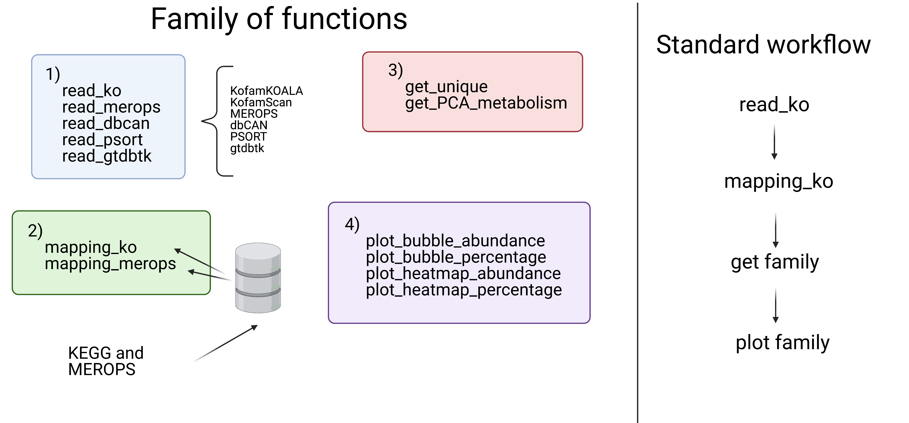

# rRbiMs

r tools for Reconstructing bin Metabolisms.

## Quick install

In R terminal:

```
install.packages("devtools")
library(devtools)
install_github("mirnavazquez/RbiMs")
```
  
## Overview 


