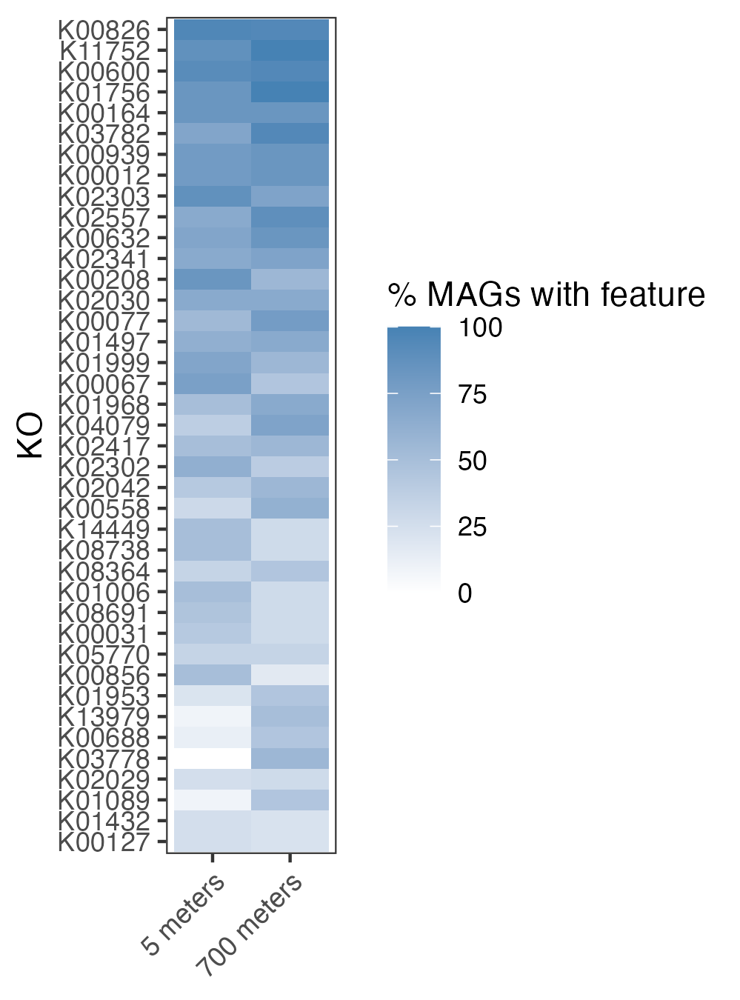
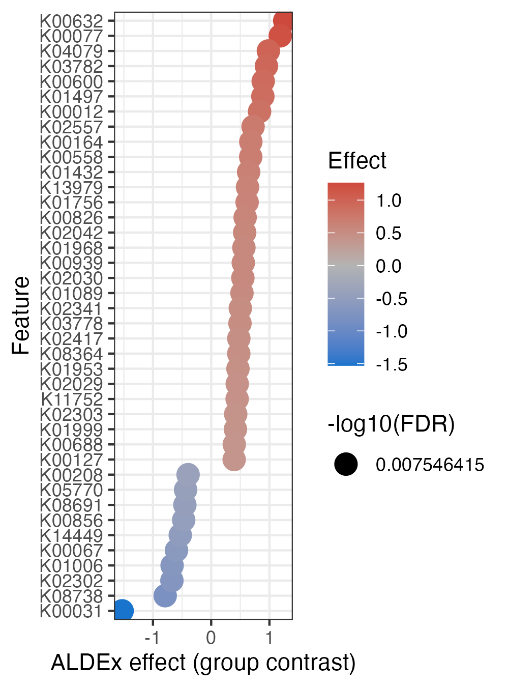
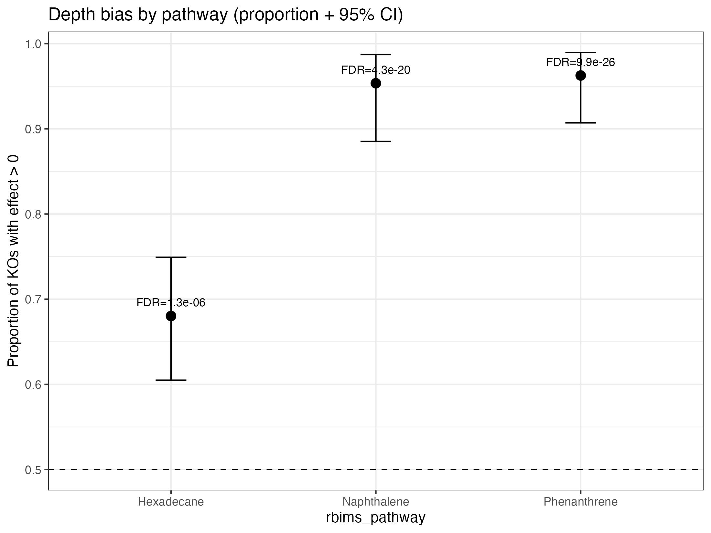

---
title: "13. Discriminant analysis and pathway-level directional bias in RBIMS"
author: "RBIMS"
output: rmarkdown::html_vignette
vignette: >
  %\VignetteIndexEntry{Discriminant analysis and pathway-level directional bias in RBIMS}
  %\VignetteEngine{knitr::rmarkdown}
  %\VignetteEncoding{UTF-8}
---

```{r setup, include=FALSE}
knitr::opts_chunk$set(
  collapse = TRUE,
  comment = "#>"
)
```

# 1. Overview

This vignette demonstrates how to:

1. Run KO-level discriminant analysis using `get_subset_discriminant()`.
2. Inspect consensus statistics and effect sizes.
3. Visualize discriminant features.
4. Quantify pathway-level directional bias using a binomial framework.

The goal is to move from **feature-level statistics** to **ecologically interpretable pathway-level patterns**.

---

# 2. Required data structure

The KO table must:

- Contain a feature column (e.g., `"KO"`).
- Contain numeric columns corresponding to MAG abundances.
- Optionally include annotation columns such as `rbims_pathway`.

The metadata must:

- Contain a `Bin_name` column matching MAG column names.
- Contain a grouping variable (e.g., `"Depth"`).

---

# 3. Load libraries

```{r}
library(rbims)
library(dplyr)
library(tidyr)
library(tibble)
library(ggplot2)
library(forcats)
```

---

# 4. Sanity checks

```{r eval=FALSE, message=FALSE, warning=FALSE}
stopifnot("KO" %in% names(ko_table))

mag_cols <- ko_table %>%
  select(where(is.numeric)) %>%
  names()

stopifnot(length(mag_cols) > 1)

stopifnot(all(c("Bin_name", "Depth") %in% names(metadata)))

metadata_use <- metadata %>%
  select(Bin_name, Depth)

stopifnot(all(mag_cols %in% metadata_use$Bin_name))
stopifnot(nlevels(factor(metadata_use$Depth)) == 2)
```

---

# 5. Run discriminant analysis

```{r, eval=FALSE}
tibble_disc <- get_subset_discriminant(
  tibble_rbims = ko_table,
  metadata     = metadata_use,
  analysis     = "KEGG",
  group_col    = "Depth",
  feature_col  = "KO",
  min_presence = 3,
  score_min    = 1
)

disc_obj <- attr(tibble_disc, "rbims_disc")
```

Inspect score distribution:

```{r, eval=FALSE}
disc_obj$consensus %>%
  count(score)
```

---

# 6. Visualizing discriminant features

## 6.1 Heatmap (Depth × Feature)

```{r, eval=FALSE}
plot_disc_heatmap(
  disc_obj  = disc_obj,
  metadata  = metadata_use,
  group_col = "Depth",
  top_n     = 40
)
```


{width=400px}

## 6.2 Effect size plot

```{r, eval=FALSE}
plot_disc_effect(disc_obj, top_n = 40)
```


{width=400px}

# 7. Pathway-level directional bias

## 7.1 Build KO dictionary

```{r, eval=FALSE}
ko_dictionary <- make_ko_dictionary(
  tibble_rbims = ko_table,
  feature_col  = "KO"
)
```

## 7.2 Calculate pathway-level directional bias

```{r, eval=FALSE}
pathways <- c("Hexadecane", "Naphthalene", "Phenanthrene")

pathway_tbl <- calc_pathway_directional_bias(
  disc_obj      = disc_obj,
  ko_dictionary = ko_dictionary,
  pathways      = pathways,
  p_null        = 0.5,
  p_alternative = "greater",
  ci_two_sided  = TRUE
)

pathway_tbl
```

## 7.3 Visualize pathway-level bias

```{r, eval=FALSE}
plot_pathway_directional_bias(
  pathway_tbl,
  reorder = TRUE,
  show_fdr_label = TRUE
)
```
{width=600px}


# 8. Interpretation

A pathway shows directional bias when:

- A large fraction of its KOs share the same effect direction.
- The binomial test indicates the proportion exceeds 0.5.
- The result remains significant after FDR correction.

---

# 9. Session information

```{r, eval=FALSE}
sessionInfo()
```
